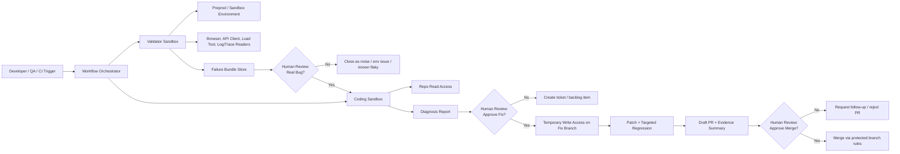
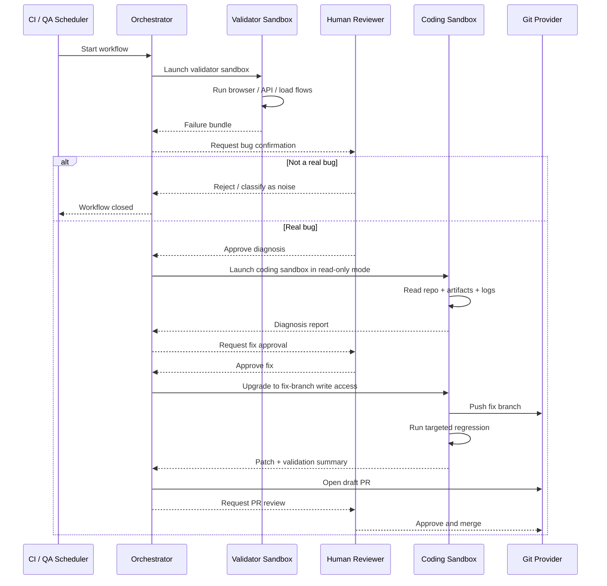
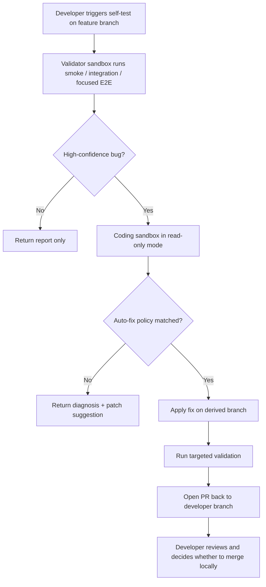
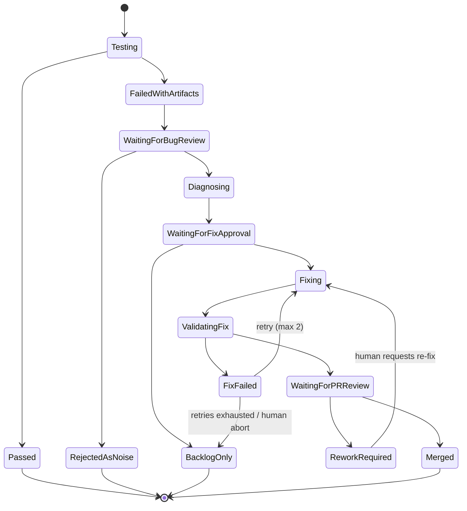

# Agentic Harness Architecture

## Overview

本文档描述一套面向复杂 Web 业务系统的 `agentic harness` 架构。目标系统以“物流后台管理系统”这类前后端分离业务为代表，但设计也适用于其他包含前端、后端、外部依赖和多环境发布链路的系统。

该架构的核心目标不是单纯补充自动化测试，而是打通一条完整闭环：

- 自动执行验证流程
- 自动采集故障证据
- 自动生成诊断报告和修复建议
- 在人类审批后执行受控修复
- 自动生成 PR 并等待人类审阅
- 在受保护分支规则下完成合并

## Goals

- 在 CI/CD 中对预发环境执行稳定的端到端验证
- 通过独立 `validator sandbox` 与 `coding sandbox` 分离测试和修复职责
- 通过 `human in the loop` 控制“确认是真 bug”和“允许生成修复 PR”两个关键决策点
- 为 QA 提供定时巡检能力，例如每小时运行对外部系统稳定性的探测流程
- 为开发者提供开发分支自测与自动修复能力，但限制在个人分支或派生分支内
- 为所有自动修复动作保留审计信息、回归记录和回滚入口

## Non-goals

- 不允许 agent 直接修改主分支
- 不允许 agent 绕过 PR 审核和分支保护规则
- 不在 v1 中允许自动执行高风险基础设施变更、数据库迁移或生产权限修改
- 不将第三方系统短时抖动默认判定为代码缺陷

## Design Principles

1. `职责分离`
   `validator agent` 负责发现和证明问题，`coding agent` 负责解释和修复问题。

2. `权限分阶段提升`
   `coding agent` 默认只读，只有在人类批准修复后才获得临时写权限，而且只能在受限修复分支上执行。

3. `artifact-first`
   agent 之间交接的是结构化故障证据包，而不是纯自然语言描述。

4. `workflow as code`
   编排逻辑由工程代码实现，确保状态可恢复、动作可重试、策略可版本化。

5. `审计优先`
   每个测试、报告、修复、回归和 PR 都要能追溯到唯一 workflow run。

## High-level Architecture



## Core Components

### 1. Workflow Orchestrator

编排器由工程代码实现，可以基于 CI 平台、任务编排引擎或独立服务承载。职责如下：

- 启动和销毁 sandbox
- 注入场景定义、memory、工具权限和环境凭据
- 驱动 workflow 状态机
- 接收人类审批结果
- 生成审计日志和运行记录

建议编排器显式维护状态，而不是只依赖 CI job 顺序。

### 2. Validator Sandbox

`validator sandbox` 面向测试和取证，具备以下能力：

- 访问预发环境或稳定沙箱环境
- 执行浏览器流程、API 调用、负载探测和回调验证
- 读取必要的日志、trace、监控摘要
- 加载历史测试 memory、已知 flaky 清单和边界约束
- 生成结构化故障证据包

`validator sandbox` 不应具备代码写权限，也不应直接创建 PR。

### 3. Coding Sandbox

`coding sandbox` 面向调试和修复，分成两个权限阶段：

- `只读阶段`
  允许读取主分支、测试分支、日志、grep、静态分析、单测和受控回归。
- `修复阶段`
  人工批准后才允许在受限修复分支上编辑代码、提交变更、运行回归、生成 Draft PR。

### 4. Failure Bundle Store

故障证据包是整个架构的关键桥梁。建议每次失败写入统一目录或对象存储，按 `workflow_run_id` 和 `scenario_id` 分桶。

建议至少包含以下内容：

- 场景 ID
- 触发源
- git SHA / build version
- 环境标识
- 重现步骤
- 期望结果 / 实际结果
- 前端截图和录屏
- DOM snapshot
- 浏览器 console
- network HAR
- 关键 API 请求响应
- 相关日志片段
- trace id
- validator 初步判断与置信度

### 5. Review Gates

需要至少两个审批点：

- `Gate 1`
  人类确认这是否是有效 bug，而不是环境抖动、外部依赖偶发错误或已知问题。
- `Gate 2`
  人类确认是否允许 coding agent 进入写代码阶段。

如果要支持自动合并，则需要第三个审批点：

- `Gate 3`
  人类审阅 PR 并同意合并；合并仍由分支保护规则控制。

## Failure Bundle Contract

建议定义一个机器可读的 JSON 元数据文件，例如：

```json
{
  "workflow_run_id": "wr_20260328_001",
  "scenario_id": "shipment-status-sync",
  "trigger_type": "preprod_ci",
  "git_sha": "abc1234",
  "environment": "preprod-a",
  "validator_summary": "Order status page shows stale shipment state after callback replay.",
  "confidence": 0.87,
  "expected_result": "The shipment status should update to Delivered within 10 seconds.",
  "actual_result": "The UI remains In Transit after callback success.",
  "attachments": {
    "screenshots": [
      "artifacts/ui-before.png",
      "artifacts/ui-after.png"
    ],
    "har": "artifacts/network.har",
    "console_log": "artifacts/browser-console.log",
    "backend_log": "artifacts/backend.log",
    "trace": "artifacts/trace.json"
  }
}
```

`coding agent` 应优先读取该结构化描述和附件，而不是只看摘要文本。

> 针对 Debate 项目的 failure bundle 扩展 schema，参见 [agentic-harness-debate-scenarios.md - Failure Bundle Schema](./agentic-harness-debate-scenarios.md#debate-specific-failure-bundle-schema)。

## Workflow Modes

### Mode A: Preprod Validation and Repair

这是主链路，面向 CI/CD 和 QA 定时巡检。



### Mode B: Developer Branch Self-test and Self-heal

这是第二阶段能力，面向开发者个人分支，提高本地集成前的反馈速度。

该模式与预发主链路的不同点如下：

- 触发源是开发者显式发起的分支自测
- 可以降低 `Gate 1` 的人工参与度，对满足自动分诊条件的错误自动进入只读诊断
- 自动修复只允许落在开发者分支的派生分支上
- 产出的是给开发者审阅的大 PR 或 patch proposal，而不是直接面向主分支

#### Auto-triage Criteria

在 Mode B 中，满足以下**全部**条件时，允许跳过 Gate 1 人工确认，自动进入只读诊断阶段：

1. **置信度阈值**：validator 输出的 `confidence >= 0.9`
2. **模式命中**：失败现象匹配 pattern registry 中的已知缺陷模式（例如 `selector-not-found`、`api-field-drift`、`null-pointer-in-render`）
3. **非 Flaky**：该场景不在 known-flaky 列表中，且最近 3 次运行无 flap（交替通过/失败）
4. **风险等级**：场景的 `risk_level` 为 `low` 或 `medium`，`high` 级场景始终要求人工确认
5. **冷却期**：同一 `scenario_id` 在过去 30 分钟内未触发过 auto-triage，防止循环误判

任一条件不满足时，回退到人工审核流程。所有 auto-triage 决策（无论通过或拒绝）均写入审计表，包含完整判定依据。



## State Machine

建议 workflow 内部显式维护以下状态：



#### 失败回退规则

- **回归失败重试**：`ValidatingFix → FixFailed` 后，orchestrator 将回归失败的测试输出和错误日志注入 coding agent 上下文，允许重新进入 `Fixing` 状态。每个 workflow run 最多重试 2 次（通过 `retry_count` 字段跟踪），超过后自动转入 `BacklogOnly` 并创建 ticket。
- **PR 拒绝重修**：`ReworkRequired` 不再是终态。人类审阅者拒绝 PR 后可选择"请求重新修复"，此时 reviewer 的反馈意见注入 coding agent 上下文，重新进入 `Fixing` 阶段。若人类选择"放弃修复"则转入 `BacklogOnly`。
- **人工中止**：在 `FixFailed` 状态下，人类可以随时选择中止修复流程，直接转入 `BacklogOnly`。

## Permission Model

### Validator Agent

- Allowed
  - 访问预发或沙箱环境
  - 浏览器自动化
  - API 调用和压测
  - 读取日志、trace、指标摘要
  - 写入 artifact store
- Forbidden
  - 写仓库
  - 创建分支
  - 提交 PR

### Coding Agent in Read-only Stage

- Allowed
  - 读取主分支和测试分支代码
  - grep、索引、静态分析
  - 读取 artifact 和日志
  - 运行只读诊断工具和必要测试
- Forbidden
  - 修改仓库
  - 推送代码
  - 改写环境配置

### Coding Agent in Fix Stage

- Allowed
  - 在临时修复分支修改代码
  - 提交 patch
  - 运行受控回归
  - 生成 Draft PR
- Forbidden
  - 直接 push 主分支
  - 绕过分支保护
  - 修改高风险基础设施

## Test Scope Strategy

为避免系统初期过重，建议将验证能力拆成三层：

- `Smoke`
  登录、核心导航、健康检查、关键页面加载。
- `Business E2E`
  运单创建、状态同步、异常件处理、对账导出、角色权限等核心主链路。
- `External Stability Probes`
  第三方物流、短信、地图、支付、回调等外部依赖探测。

QA 的每小时巡检应优先使用第三层，避免在预发环境频繁跑高成本或破坏性全链路流程。

#### 场景映射示例

| 层级 | Scenario ID | 描述 | 建议频率 | 典型耗时 |
|---|---|---|---|---|
| Smoke | `smoke-health-check` | 健康检查端点可达、登录页可加载 | 每次部署 + 每 15 分钟 | < 30s |
| Smoke | `smoke-core-navigation` | 核心导航路径可点击、无 JS 报错 | 每次部署 | < 1min |
| Smoke | `smoke-api-schema` | OpenAPI schema 结构未发生破坏性变更 | 每次部署 | < 10s |
| Business E2E | `e2e-order-create` | 创建运单完整流程（填写→提交→确认） | 每次部署 + 每小时 | 2-5min |
| Business E2E | `e2e-status-sync` | 物流状态回调后 UI 正确更新 | 每次部署 | 1-3min |
| Business E2E | `e2e-export-reconciliation` | 对账导出文件格式和数据完整性 | 每日 | 3-5min |
| External Probes | `probe-logistics-api` | 第三方物流查询接口可达性和响应格式 | 每小时 | < 30s |
| External Probes | `probe-sms-gateway` | 短信网关连通性（dry-run 模式） | 每小时 | < 15s |
| External Probes | `probe-map-service` | 地图/地理编码服务可用性 | 每小时 | < 20s |

#### 分类规则

- 如果场景只涉及**可达性和基础渲染**，归入 Smoke
- 如果场景覆盖**完整业务链路**且涉及数据写入或状态变更，归入 Business E2E
- 如果场景的主要目的是**探测第三方依赖**的可用性而非验证自身逻辑，归入 External Probes
- 同一业务链路可以同时有 Smoke 版本（只检查入口可达）和 E2E 版本（走完全流程）

> 针对具体项目的场景设计，参见 [agentic-harness-debate-scenarios.md](./agentic-harness-debate-scenarios.md)。

## Auto-fix Policy

建议用白名单策略约束自动修复范围。v1 可考虑允许的修复类型：

- 明显的前端选择器或等待条件修复
- 已知 API 字段名漂移后的映射修复
- 空值保护和边界条件修复
- 低风险条件分支修复
- 对应测试用例同步更新

建议暂不允许自动修复的类型：

- 数据库 schema 变更
- 权限模型变更
- 生产配置或密钥修改
- 大范围重构
- 需要跨多个服务协议协同变更的修复

## Rollout Plan

### Phase 1

- 实现 workflow orchestrator 最小状态机
- 打通 validator sandbox
- 固化 failure bundle 协议
- 覆盖 5 到 10 条高价值业务链路

### Phase 2

- 引入 coding sandbox 的只读诊断能力
- 自动输出 diagnosis report
- 接入人工审批和 issue/backlog 流转

### Phase 3

- 开启批准后自动修复
- 限制在 fix branch 上执行
- 自动跑定向回归并生成 Draft PR

### Phase 4

- 引入开发者分支自测与自愈
- 对高置信、低风险缺陷支持自动 triage 和自动修复
- 优化策略评估和 flaky 控制

## Success Metrics

- 平均发现到诊断时间
- 平均诊断到 PR 时间
- 人工确认后进入修复阶段的转化率
- 自动修复回归通过率
- PR 审阅通过率
- flake rate
- 外部依赖异常识别准确率

## Open Questions

- validator sandbox 是否需要区分“功能验证”和“稳定性探测”两套工具链
- coding agent 的修复权限是否需要再细分为“只改测试”和“可改业务代码”
- 是否需要在 workflow 中增加自动回滚策略
- 是否需要单独的 triage service 来降低 human gate 的负担

## Recommendation

这套架构适合作为初步的自动化 harness 工程基线。第一阶段不要追求“完全自动确认 bug、完全自动修复、完全自动合并”，而应优先保证以下三件事可靠：

- 故障证据完整且可复现
- 审批点明确且可审计
- 修复分支和主分支的安全边界清晰

在这三点稳定之后，再逐步增加自动 triage、自动修复和开发分支自愈能力，成功率会高很多。
