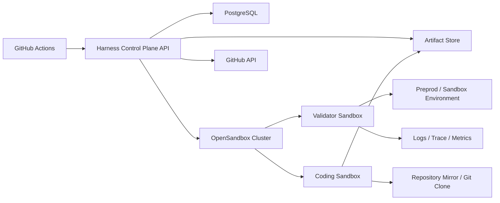
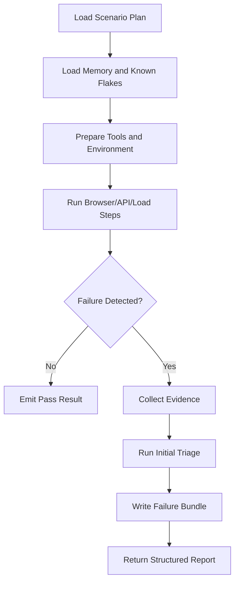
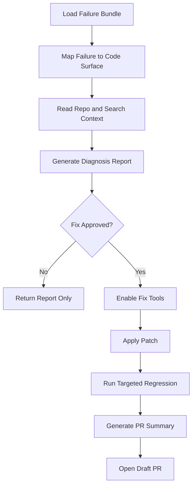
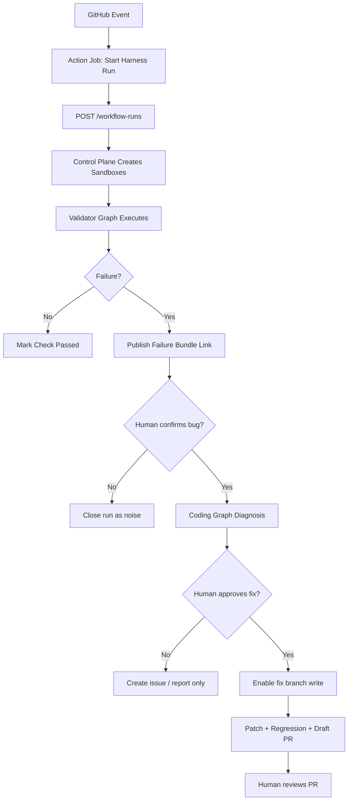

# Agentic Harness Technical Design

## Overview

本文档在 [agentic-harness-architecture.md](./agentic-harness-architecture.md) 的基础上继续细化，给出技术选型、核心组件设计、sandbox 设计、LangGraph agent 设计、工具权限模型以及 GitHub Actions 流水线方案。

本文档默认以下约束：

- sandbox 运行时使用 Alibaba 开源 `OpenSandbox`
- agent 编排框架使用 `LangGraph`
- sandbox 默认环境为 Linux
- CI/CD 流水线使用 `GitHub Actions`
- 工具层设计参考 Cursor 一类 coding agent 的工具哲学，但要更严格地做权限分层

## Technical Selection

### Control Plane

- Language: `Python 3.12`
- Service framework: `FastAPI`
- Background execution: `Arq`（推荐，见下方对比）
- State store: `PostgreSQL`
- Artifact metadata store: `PostgreSQL`
- Binary artifact store: `S3-compatible object storage` 或本地 MinIO

选择理由：

- `LangGraph` 的 Python 生态成熟，与现有后端技术栈衔接自然
- 控制平面需要显式状态机、审批状态、运行日志和 artifact 索引，关系型数据库更稳
- artifact 附件体积较大，适合对象存储

### Trade-off Analysis

#### Agent Framework

| 维度 | LangGraph | CrewAI | AutoGen | 纯状态机（自研） |
|---|---|---|---|---|
| 显式状态机 | 一等公民，graph state + conditional edges | 无，依赖角色编排 | 无，基于会话流 | 完全自定义 |
| Human-in-the-loop gate | 内置 interrupt/resume | 需自行实现 | 需自行实现 | 完全自定义 |
| 工具权限动态切换 | 支持，node 级别切换 tool set | 不支持 | 不支持 | 完全自定义 |
| Checkpoint / Resume | 内置持久化 checkpointer | 无 | 无 | 需自行实现 |
| 可观测性 | LangSmith 集成 | 有限 | 有限 | 需自行实现 |
| 生态成熟度 | 高，LangChain 生态 | 中 | 中 | 无生态 |
| 学习曲线 | 中等 | 低 | 低 | 高（维护成本） |
| 供应商锁定 | 中（LangChain 生态） | 低 | 低 | 无 |

**决策**：选择 LangGraph。harness 的核心需求是显式状态机 + human gate + 工具权限分阶段切换 + checkpoint/resume，这四项在 LangGraph 中均为一等特性，其他框架需要大量自行实现。纯状态机虽然无锁定，但开发和维护成本显著更高。接受 LangChain 生态的中度锁定作为换取开发效率的代价。

#### Sandbox Runtime

| 维度 | OpenSandbox | Docker + gVisor | Firecracker | E2B |
|---|---|---|---|---|
| 进程隔离 | 容器级 + 用户态隔离 | 容器 + 系统调用过滤 | microVM 级 | 容器级（托管） |
| 启动速度 | < 2s | < 3s | < 125ms | < 5s（含网络） |
| 网络策略 | API 级 allowlist | iptables / CNI | 需自行配置 | 有限控制 |
| 凭据注入 | API 原生支持 | 需 volume/env mount | 需 mmds/vsock | API 支持 |
| Session 生命周期 API | 完整（创建/暂停/销毁） | 需自行封装 | 需自行封装 | 完整 |
| 自托管 vs SaaS | 自托管 | 自托管 | 自托管 | SaaS |
| 成本 | 基础设施成本 | 基础设施成本 | 基础设施成本 | 按量计费 |

**决策**：选择 OpenSandbox。关键因素是 API 原生的凭据注入和网络策略控制，这两项是 harness 权限模型的核心需求。Docker+gVisor 虽然更通用但需要大量封装工作。Firecracker 隔离最强但启动后的工具链配置复杂度高。E2B 作为 SaaS 在数据合规和网络延迟上有顾虑。

#### Background Execution

| 维度 | Arq | Celery |
|---|---|---|
| Async 原生 | 是（原生 asyncio） | 否（需 gevent/eventlet 适配） |
| Broker | Redis 仅 | Redis / RabbitMQ / SQS 等 |
| 复杂度 | 轻量，单文件可配置 | 重，需 worker/beat/flower 等组件 |
| 重试 / Cron | 内置 | 内置，功能更丰富 |
| Worker 扩展 | 适合中等规模 | 适合大规模分布式 |
| 监控 | 基础 | Flower + Prometheus exporter |

**决策**：推荐 Arq。理由：harness 的控制平面是 async-first 架构（FastAPI + httpx + LangGraph），Arq 的原生 asyncio 支持避免了 Celery 的 async 适配问题。Redis 已经是 LangGraph checkpointer 的依赖，无需引入额外 broker。当前任务规模（workflow run 级别，非海量消息队列）在 Arq 的承载范围内。若未来规模超出 Arq 能力，可迁移至 Celery（任务接口兼容性高）。

### Sandbox Runtime

- Sandbox runtime: `OpenSandbox`
- Default image OS: `Ubuntu 22.04 LTS`
- Session model: 一次 workflow run 对应两个独立 sandbox session
- Network policy:
  - validator sandbox 可访问预发域名、日志网关、观测服务、必要第三方测试入口
  - coding sandbox 默认禁止外网，只允许代码仓库和内部 artifact 读取

选择理由：

- OpenSandbox 适合将 agent 执行与权限边界下沉到隔离运行时
- Linux 环境更适合统一浏览器自动化、压测、日志处理和代码工具链

### Agent Runtime

- Agent framework: `LangGraph`
- LLM provider: 可配置 OpenAI-compatible provider
- Prompt asset management: repo 内版本化 prompt + policy files
- Memory:
  - 短期 memory: 单次 workflow state
  - 长期 memory: 历史 flaky、外部依赖已知异常、项目调试约束

### Browser and Test Stack

- Browser automation: `Playwright`
- API verification: `httpx` / `pytest`
- Load probe: `k6` 或 `Locust`
- Visual diff: `Playwright screenshot + pixelmatch` 或 `Resemble.js`
- Log/trace query adapters: OpenTelemetry-compatible backend, Loki, Elasticsearch, Datadog 等通过 adapter 封装

### Git and Delivery

- CI/CD: `GitHub Actions`
- PR automation: `GitHub App` 或 `gh` CLI with bot token
- Human approval:
  - GitHub PR review
  - GitHub issue/comment approval
  - GitHub environment protection rules

## System Context



## Repository Layout

在深入各组件设计之前，先建立物理目录结构的心智模型。如果后续要在当前仓库内落地，建议新增以下目录：

```text
automation/
  control_plane/
    app/
      api/
      services/
      models/
      policies/
      adapters/
  graphs/
    validator/
    coding/
  sandbox_profiles/
    validator-linux-browser/
    coding-linux-readonly/
    coding-linux-fix/
  prompts/
    validator/
    coding/
  schemas/
    failure_bundle.schema.json
    diagnosis_report.schema.json
  .github/
    workflows/
      harness-preprod.yml
      harness-scheduled-probe.yml
      harness-self-heal.yml
```

下文的组件设计将引用此目录结构中的路径。

## Core Components

### 1. Harness Control Plane

这是整个系统的核心服务，建议实现为独立后端服务。

职责：

- 接收来自 GitHub Actions、QA 定时任务、手动触发的 workflow 请求
- 创建 workflow run、状态记录和审批任务
- 调用 OpenSandbox 创建 validator 和 coding sandbox
- 将 LangGraph graph 运行时注入 sandbox
- 管理 artifact 索引和访问地址
- 控制权限升级，例如将 coding sandbox 从只读提升为 fix-branch write
- 负责关闭、重试和终止 workflow

建议模块：

- `api/`
  提供 workflow 启动、审批、状态查询接口
- `services/workflows/`
  workflow 生命周期管理
- `services/sandboxes/`
  OpenSandbox session 管理
- `services/artifacts/`
  artifact metadata 和对象存储索引
- `services/github/`
  PR、comment、status check、branch 管理
- `services/policies/`
  权限、auto-fix policy、review gate 策略
- `services/memory/`
  历史 flaky 和记忆管理

### 2. OpenSandbox Manager

该模块是对 OpenSandbox 的一层适配封装，避免业务逻辑直接耦合到 runtime API。

职责：

- 根据 workflow mode 启动不同镜像模板
- 注入只读或读写 git credential
- 配置 network allowlist
- 配置 CPU、内存、磁盘和超时
- 下发工具 manifest
- 回收过期 session

建议支持两类 sandbox profile：

- `validator-linux-browser`
- `coding-linux-readonly`
- `coding-linux-fix`

其中 `coding-linux-fix` 不是长期常驻 profile，而是从只读 profile 升级或重建出的短期 profile。

### 3. Artifact Service

artifact service 负责归档 validator 和 coding agent 交互所需的所有材料。

建议 artifact 分类：

- `failure_bundle.json`
- `screenshots/*.png`
- `video/*.webm`
- `network/*.har`
- `logs/*.log`
- `trace/*.json`
- `diagnosis_report.md`
- `patch_summary.md`
- `regression_results.json`

建议对象路径格式：

`runs/{workflow_run_id}/{scenario_id}/{artifact_type}/...`

### 4. Policy Engine

policy engine 决定谁能用什么工具、能否自动进入下一阶段、哪些修复允许自动执行。

建议最小策略维度：

- `trigger_type`
  preprod、scheduled_probe、developer_self_test
- `risk_level`
  low、medium、high
- `tool_scope`
  browse、api、logs、repo_read、repo_write、git_push、pr_open
- `change_scope`
  tests_only、frontend_only、backend_only、cross_service

## LangGraph Design

## Validator Graph

validator agent 的目标不是自由探索，而是遵循受控测试计划，执行标准化流程并生成 failure bundle。

建议 graph 节点：



建议 graph state：

```json
{
  "workflow_run_id": "string",
  "scenario_id": "string",
  "environment": "string",
  "steps": [],
  "tool_events": [],
  "artifacts": [],
  "known_flakes": [],
  "triage_result": {},
  "status": "running"
}
```

节点职责：

- `Load Scenario Plan`
  加载预定义测试流程和断言
- `Load Memory and Known Flakes`
  加载历史波动、允许重试的外部故障模式
- `Prepare Tools and Environment`
  初始化浏览器、API token、日志查询上下文
- `Run Browser/API/Load Steps`
  执行具体验证步骤
- `Collect Evidence`
  截图、录屏、HAR、日志片段、trace
- `Run Initial Triage`
  判断更像真实缺陷、环境问题还是 flaky
- `Write Failure Bundle`
  归档结构化结果

## Coding Graph

coding agent 需要明确区分“只读诊断阶段”和“批准后修复阶段”。



建议 graph state：

```json
{
  "workflow_run_id": "string",
  "failure_bundle_uri": "string",
  "repo_ref": "string",
  "suspected_files": [],
  "diagnosis": {},
  "patch_plan": {},
  "regression_results": {},
  "fix_approved": false
}
```

节点职责：

- `Load Failure Bundle`
  读取 validator 的结构化证据
- `Map Failure to Code Surface`
  将错误现象映射到可能的模块和文件
- `Read Repo and Search Context`
  只读分析代码、日志、历史变更
- `Generate Diagnosis Report`
  产出根因分析、风险点和修复建议
- `Enable Fix Tools`
  在审批后切换到可编辑工具集
- `Apply Patch`
  只在 fix branch 操作
- `Run Targeted Regression`
  执行最小必要回归
- `Generate PR Summary`
  输出变更摘要、风险和验证结果

## Sandbox Images

### Validator Image

建议基础镜像内容：

- Ubuntu 22.04
- Python 3.12
- Node.js 20
- Playwright browsers
- k6 或 Locust
- curl、jq、ripgrep、git
- screenshot / image diff 工具
- OpenTelemetry exporter 或日志查询 CLI

### Coding Image

建议基础镜像内容：

- Ubuntu 22.04
- Python 3.12
- Node.js 20
- git、ripgrep、fd、jq
- 语言工具链和项目依赖缓存
- repo local mirror mount
- patch / diff / formatter / test runner

`coding image` 中默认不注入写权限 credential。只有进入 fix 阶段后，才下发限权 bot token 或短期凭据。

## Tooling Model

工具层面参考 Cursor 的理念，但要按角色和阶段拆分为多套 manifest，而不是“一套全能工具”。

### Design Principles

- 工具默认最小权限
- 工具清单由 control plane 下发
- 工具执行全量记录到 audit log
- 写工具与危险 shell 必须分离
- 尽量以结构化工具替代任意 shell

### Shared Utility Tools

这些工具可在两类 sandbox 中复用，但权限不同：

- `read_file`
- `list_dir`
- `grep_search`
- `glob_search`
- `fetch_artifact`
- `write_artifact`
- `run_structured_shell`
- `git_show_ref`
- `git_diff_refs`

### Validator Tool Set

建议 validator 使用以下工具：

- `browser_open`
- `browser_click`
- `browser_type`
- `browser_wait`
- `browser_extract`
- `browser_screenshot`
- `browser_console_logs`
- `browser_network_har`
- `http_request`
- `load_probe`
- `log_query`
- `trace_query`
- `metrics_query`
- `compare_screenshot`
- `memory_read`
- `artifact_write`

禁用工具：

- `edit_file`
- `apply_patch`
- `git_commit`
- `git_push`
- `open_pr`

### Coding Tool Set: Read-only Stage

建议 coding agent 只读阶段使用以下工具：

- `read_file`
- `list_dir`
- `grep_search`
- `glob_search`
- `git_show_ref`
- `git_diff_refs`
- `git_blame`
- `search_symbol`
- `run_tests_readonly`
- `run_linter_readonly`
- `read_failure_bundle`
- `log_query`

禁用工具：

- `edit_file`
- `apply_patch`
- `git_checkout_new_branch`
- `git_commit`
- `git_push`
- `open_pr`

### Coding Tool Set: Fix Stage

批准后切换到 fix 工具集：

- `edit_file`
- `apply_patch`
- `create_fix_branch`
- `run_tests_targeted`
- `run_formatter`
- `git_commit`
- `git_push_fix_branch`
- `open_draft_pr`
- `attach_artifacts_to_pr`

仍应禁用：

- `push_main`
- `merge_pr`
- `modify_secrets`
- `unrestricted_shell`

### Structured Shell Design

即使保留 shell，也建议采用受限结构化命令白名单，而不是给 agent 完整 bash。

例如：

- Allowed categories
  - `git status`
  - `git show`
  - `pytest path::test_name`
  - `npm test -- path`
  - `npm run build`
  - `python -m ...` 的只读分析命令
- Forbidden categories
  - `curl` 任意外网上传
  - `sudo`
  - `rm -rf`
  - 修改系统配置
  - 任意网络扫描

## Tool Manifest Example

```json
{
  "tool_profile": "coding-readonly",
  "tools": [
    {"name": "read_file", "mode": "read"},
    {"name": "grep_search", "mode": "read"},
    {"name": "git_show_ref", "mode": "read"},
    {"name": "run_tests_readonly", "mode": "exec", "scope": "whitelist"},
    {"name": "log_query", "mode": "read"}
  ],
  "restrictions": {
    "network": "internal-only",
    "git_push": false,
    "filesystem_write": false
  }
}
```

## GitHub Actions Pipeline Design

建议至少拆成三类 workflow：

### 1. Preprod Validation Workflow

触发条件：

- pull request 更新后
- merge 到主分支后的预发部署完成
- 手动触发

主步骤：

1. checkout repo
2. build metadata
3. call harness control plane `start_workflow(trigger=preprod_ci)`
4. 等待 validator 结果
5. 将 run URL 写入 GitHub check
6. 如失败则等待人工确认 gate
7. 如批准则继续 coding graph
8. draft PR 创建后回写链接

### 2. Scheduled Probe Workflow

触发条件：

- `schedule` 每小时运行

主步骤：

1. call harness control plane `start_workflow(trigger=scheduled_probe)`
2. validator 跑外部稳定性探测
3. 产出报告
4. 如有异常则创建 GitHub issue 或发送通知
5. 如命中 runbook 类修复且被批准，则进入修复流程

### 3. Developer Self-heal Workflow

触发条件：

- `workflow_dispatch`
- 开发者在 PR comment 中输入触发命令，例如 `/self-heal`

主步骤：

1. 针对当前 feature branch 启动 validator
2. 高置信失败自动进入 coding read-only diagnosis
3. 命中 auto-fix policy 后自动修复到派生分支
4. 创建面向开发者分支的 PR

## GitHub Actions Example Shape



## GitHub Integration Strategy

建议通过 GitHub App 或专用 bot identity 做以下动作：

- 创建 check run
- 在 PR 中回写 run 状态
- 创建或更新 draft PR
- 上传 artifact link
- 管理 label，例如 `agent-diagnosed`、`awaiting-bug-review`、`awaiting-fix-approval`

建议审批入口尽量落在 GitHub 内部，减少上下文切换。

## Branch Strategy

建议分支命名：

- 预发修复分支：
  `agent/fix/{workflow_run_id}`
- 开发者自愈分支：
  `agent/self-heal/{base_branch}/{workflow_run_id}`

建议 PR 策略：

- validator 失败后，不自动直接新开 PR
- coding diagnosis 完成且 fix 获批后，才允许创建 Draft PR
- 只有 GitHub branch protection 全绿且人类 review 通过，才允许 merge

## Data Model

建议数据库核心表：

- `workflow_runs`
  - id
  - trigger_type
  - status
  - repo
  - git_sha
  - scenario_set
  - created_at
- `sandbox_sessions`
  - id
  - workflow_run_id
  - role
  - profile
  - status
  - permissions
- `artifacts`
  - id
  - workflow_run_id
  - scenario_id
  - type
  - uri
  - metadata
- `approvals`
  - id
  - workflow_run_id
  - gate_type
  - approver
  - decision
  - decided_at
- `patches`
  - id
  - workflow_run_id
  - branch_name
  - commit_sha
  - pr_number

## Security Boundaries

### Validator Sandbox

- 允许访问预发和观测面
- 不允许访问 git write credential
- 不允许访问主仓库写入 token

凭据命名约定：所有 validator sandbox 注入的环境变量使用 `HARNESS_VAL_` 前缀，例如 `HARNESS_VAL_PREPROD_TOKEN`、`HARNESS_VAL_LOG_QUERY_TOKEN`。sandbox 销毁时所有凭据随 session 一并清除。

### Coding Sandbox

- 默认不允许访问预发业务环境
- 只允许读取 artifact 和 repo
- fix 阶段只拿到短期 fix-branch push token
- 禁止使用主分支写权限

#### Read-only 阶段凭据

- **实现**：GitHub App installation token，scope 为 `contents:read`
- **TTL**：与 sandbox session 生命周期绑定，最长 2 小时
- **注入方式**：通过 OpenSandbox credential API 注入为 `HARNESS_CODE_GIT_TOKEN`
- **限制**：该 token 无法推送、创建分支或打开 PR

#### Fix 阶段凭据

- **推荐实现**：GitHub App installation token，scope 为 `contents:write`
  - 通过 branch protection rule 限制该 token 只能推送到 `agent/fix/{workflow_run_id}` 命名模式的分支
  - 主分支和其他受保护分支上的 push 被 branch protection 拦截
- **备选实现**：Per-workflow deploy key（更简单但更难撤销，且无分支命名限制）
- **TTL**：30 分钟，允许续期一次（总计最长 60 分钟）
- **撤销触发条件**：
  - Draft PR 已创建（正常结束）
  - TTL 过期（超时）
  - 回归测试失败且重试耗尽（修复失败）
  - 人工在审批界面点击"中止修复"（人工中止）
- **撤销方式**：control plane 调用 GitHub API 删除 installation token 或 revoke deploy key

### Approval Security

- 审批操作要落到有身份的 GitHub 用户
- 所有批准事件都需要写审计表
- bot 不能自己批准自己的 PR

#### 实现细节

- **身份验证**：审批必须由 GitHub 认证用户发起，通过 PR review、issue comment 或 environment protection rule 触发
- **Bot 自批限制**：在 CODEOWNERS 中排除 harness bot 账号，确保 bot 生成的 PR 必须由人类 approve
- **审计表 schema**：每条审批记录包含 `workflow_run_id`、`gate_type`（bug_review / fix_approval / pr_review）、`approver`（GitHub username）、`decision`（approve / reject / abort）、`decided_at`（UTC timestamp）、`context`（审批时的附加评论）
- **审批有效期**：Gate 2（fix approval）的审批结果在 4 小时内有效，超时后需重新审批

## Harness Self-Observability

Harness 系统本身也需要可观测性。以下是建议监控的核心维度：

| 监控对象 | 关键指标 | 告警条件 |
|---|---|---|
| Sandbox Session | 创建成功率、平均存活时长、OOM kill 次数 | 创建失败率 > 5% 或 OOM 连续 2 次 |
| LangGraph 执行 | 每 step 延迟、graph 总执行时间、卡死检测 | 单 step > 5min 或 graph 无进展 > 10min |
| GitHub App Token | 剩余有效期、刷新成功率 | 有效期 < 5min 且刷新失败 |
| Artifact Store | 写入延迟、存储使用量、上传失败率 | 写入延迟 P99 > 10s 或上传失败 |
| Control Plane API | 请求错误率、队列深度、响应延迟 | 5xx 率 > 1% 或队列深度 > 50 |
| Background Tasks (Arq) | 失败任务数、worker 心跳、重试率 | worker 心跳丢失 > 2min 或失败率 > 10% |

### 实现建议

- **Metrics 暴露**：control plane 提供 Prometheus 兼容的 `/metrics` 端点，供 Grafana 或其他面板消费
- **结构化日志**：所有组件使用 JSON 格式日志，包含 `workflow_run_id`、`component`、`level`、`message` 字段，便于在 Loki / Elasticsearch 中检索
- **健康检查增强**：`/api/health` 端点扩展为深度检查，包含 PostgreSQL 连通性、Redis 连通性、OpenSandbox API 可达性、artifact store 可写性
- **Dead-man's switch**：scheduled probe workflow 应配置外部看门狗（例如 Healthchecks.io 或 PagerDuty heartbeat），如果 probe 在预期时间内未上报结果则触发告警，防止 "harness 本身挂了但无人知道" 的盲区

## Rollout Recommendation

### Step 1: Control Plane MVP

- FastAPI + PostgreSQL + MinIO
- OpenSandbox manager
- workflow run API
- validator graph 原型

### Step 2: Validator-first Delivery

- Playwright + API + artifact bundle
- GitHub Actions 集成
- 人工确认 bug gate

### Step 3: Read-only Coding Diagnosis

- coding graph 只读模式
- diagnosis report 输出
- GitHub comment / check integration

### Step 4: Approved Fix Mode

- fix branch token
- patch apply
- targeted regression
- draft PR

### Step 5: Developer Self-heal

- feature branch workflow_dispatch
- auto-fix policy
- developer review loop

## Recommendation

技术选型上，这套组合是合理的：

- `OpenSandbox` 负责安全隔离和权限边界
- `LangGraph` 负责 agent 工作流和状态驱动
- `GitHub Actions` 负责事件触发和 CI 接入
- `Playwright + API probe + load probe` 负责验证面
- `GitHub App + branch protection` 负责最终治理面

最关键的不是先把 agent 做得多聪明，而是先把这三层打牢：

- control plane 的状态和审批
- sandbox 的权限和隔离
- artifact 和工具协议的标准化

只有这三层稳了，后续自动 triage、自动修复和开发分支自愈能力才会真正可持续。
